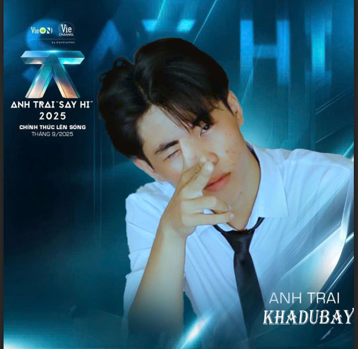

# CV
# CV
Đầu tiên vào chat GPT tìm promt 

tôi yêu cầu:
tôi cần tạo 1 wedsite giới thiệu UI/UX về bản thân gồm những nội dung sao : họ tên là Nguyễn Quốc Kha , câu mô tả ngắn mang dấu ấn cá nhân là : tài năng là 1 yếu tố nhỏ trong công thức đi tới thành công. Giới thiệu bản thân : ngày tháng năm sinh 15/03/2006 quê ở Tiền Giang hiện tại đang sinh sống ở TPHCM là sinh viên năm 2 của Đại Học Gia Định . Định hướng nghề nghiệp : tương lai sẽ đi làm ở công ty có liên quan tới thiết kế . Kỹ năng chính : biết sử dụng công cụ thiết kế như photoshop , illustrator .Phần dự án (Projects):
Tên dự án;
Mô tả ngắn;
Hình ảnh minh họa (khuyến khích có sử dụng AI);
Vai trò của sinh viên trong dự án;
Phần thể hiện kỹ năng hoặc kinh nghiệm (Skills/Experience): trình bày bằng biểu đồ, sơ đồ, thẻ thông tin hoặc hình thức trực quan khác;
Phần liên hệ (Contact): thông tin liên hệ và lời kêu gọi hành động rõ ràng.
 Yêu cầu thiết kế
Website phải thể hiện được bản sắc cá nhân rõ ràng thông qua màu sắc, kiểu chữ và phong cách thiết kế;
Giao diện thân thiện với nhà tuyển dụng: bố cục rõ ràng, dễ đọc, dễ tiếp cận thông tin;
Đảm bảo khả năng hiển thị tốt trên nhiều thiết bị (responsive);
Có tối thiểu một yếu tố tương tác (ví dụ: hiệu ứng chuyển động, hiệu ứng hover, chuyển đổi giao diện sáng/tối).

Chat trả lời:
Gợi ý concept website UI/UX cá nhân
Phong cách đề xuất
Tone màu: Đen + xanh neon hoặc trắng + xanh pastel hiện đại
Phong cách: Minimal UI/UX Portfolio
Font chữ: Poppins / Montserrat
Hiệu ứng:
Hover card
Animation fade-in khi cuộn
Dark/Light Mode
Hiệu ứng gradient glow
Bố cục website đề xuất
1. Hero Section (Trang đầu)
Hiển thị thật nổi bật để tạo ấn tượng với nhà tuyển dụng.
Nội dung:
Ảnh đại diện
Họ tên lớn:
Nguyễn Quốc Kha
Câu slogan:
“Tài năng là một yếu tố nhỏ trong công thức đi tới thành công.”
Nút:
Xem dự án
Liên hệ
Hiệu ứng:
Text typing animation
Background gradient động
2. About Me — Giới thiệu bản thân
Nội dung:
Sinh ngày: 15/03/2006
Quê quán: Tiền Giang
Hiện sống tại: TP.HCM
Sinh viên năm 2 trường:
Đại Học Gia Định
Đoạn mô tả:
Tôi là một sinh viên yêu thích thiết kế giao diện và trải nghiệm người dùng. Luôn học hỏi, sáng tạo và hướng tới việc tạo ra những sản phẩm trực quan, hiện đại và thân thiện với người dùng.
3. Career Goal — Định hướng nghề nghiệp
Nội dung:
Trong tương lai tôi mong muốn làm việc tại các công ty liên quan đến thiết kế UI/UX hoặc thiết kế đồ họa để phát triển tư duy sáng tạo và kỹ năng chuyên môn.
4. Skills — Kỹ năng
Kỹ năng chính:
Photoshop
Illustrator
UI Design
Responsive Design
Gợi ý trình bày:
Dạng thanh tiến độ:
Photoshop — 85%
Illustrator — 80%
UI/UX Design — 75%
Hoặc dạng card:
Icon + tên kỹ năng + mô tả ngắn
Có thể thêm:
HTML/CSS cơ bản
Figma
Canva
5. Projects — Dự án
Bạn nên có tối thiểu 3 project.
Project 1 — Landing Page 5G
Mô tả:
Thiết kế giao diện landing page giới thiệu công nghệ 5G hiện đại.
Vai trò:
Thiết kế UI
Chỉnh sửa hình ảnh
Responsive Layout
Gợi ý AI:
Dùng AI tạo mockup điện thoại/công nghệ.
Project 2 — Coffee App UI
Mô tả:
Thiết kế giao diện ứng dụng đặt cà phê trên điện thoại.
Vai trò:
Wireframe
UI Mobile
Prototype
Project 3 — Fashion Website
Mô tả:
Website bán hàng thời trang với giao diện tối giản.
Vai trò:
Thiết kế banner
UX Layout
Responsive Design
6. Experience / Visual Skills
Gợi ý trình bày trực quan:
Timeline:
2023 — Bắt đầu học Photoshop
2024 — Học Illustrator
2025 — Thiết kế UI Website
Hoặc:
Radar chart
Circular progress
Skill cards animation
7. Contat Section
Nội dung:
Email
Facebook
GitHub
Số điện thoại
CTA:
“Hãy cùng nhau tạo nên những sản phẩm sáng tạo và khác biệt.”
Nút:
Contact Me
Download CV
Các yếu tố tương tác nên có
Bắt buộc nên thêm:
✅ Dark/Light Mode
✅ Hover animation
✅ Smooth scroll
✅ Fade animation khi cuộn
✅ Responsive Mobile
Gợi ý màu sắc UI đẹp
Option 1 — Dark UI
Background: #0f172a
Primary: #38bdf8
Text: White
Option 2 — Clean White
Background: #ffffff
Primary: #2563eb
Secondary: #e2e8f0
Cấu trúc file nên làm
portfolio/│├── index.html├── style.css├── script.js├── images/

tôi yêu cầu:
tạo cho tôi 1 promt UI/UX chuẩn để chạy trên github

chat trả lời:
Bạn là một chuyên gia UI/UX Designer và Front-End Developer.
Hãy tạo cho tôi một website Portfolio cá nhân hiện đại, chuẩn UI/UX, responsive hoàn chỉnh bằng HTML, CSS và JavaScript thuần để có thể chạy trực tiếp trên GitHub Pages hoặc GitHub Codespaces.
# Mục tiêu website
Thiết kế một portfolio cá nhân dành cho sinh viên ngành thiết kế/UIUX với giao diện chuyên nghiệp, hiện đại, tối giản nhưng có điểm nhấn sáng tạo để gây ấn tượng với nhà tuyển dụng.
# Thông tin cá nhân
Họ tên: Nguyễn Quốc Kha
Câu slogan:
"Tài năng là một yếu tố nhỏ trong công thức đi tới thành công."
Thông tin cá nhân:
* Sinh ngày: 15/03/2006
* Quê quán: Tiền Giang
* Hiện đang sống tại: TP.HCM
* Sinh viên năm 2 Đại học Gia Định
Định hướng nghề nghiệp:
Trong tương lai mong muốn làm việc tại các công ty liên quan tới thiết kế UI/UX hoặc thiết kế đồ họa.
# Kỹ năng chính
* Photoshop
* Illustrator
* UI/UX Design
* Responsive Design
* HTML/CSS cơ bản

# Yêu cầu giao diện

* Thiết kế chuẩn UI/UX hiện đại
* Phong cách minimal nhưng sang trọng
* Có hiệu ứng hover mềm mại
* Có animation fade-in khi scroll
* Có Dark/Light Mode toggle
* Responsive trên:

  * Desktop
  * Tablet
  * Mobile
* Font chữ hiện đại (Poppins hoặc Montserrat)
* Màu sắc:

  * Dark mode: nền đen/xanh navy + neon blue
  * Light mode: trắng/xanh pastel
* Header cố định khi cuộn
* Smooth scrolling

# Bố cục website

## 1. Hero Section

Bao gồm:

* Ảnh đại diện lớn
* Họ tên nổi bật
* Typing animation cho slogan
* 2 nút:

  * Xem dự án
  * Liên hệ

Background có gradient hoặc hiệu ứng glow hiện đại.

## 2. About Me

Hiển thị:

* Thông tin cá nhân
* Đoạn giới thiệu ngắn về bản thân
* Card UI đẹp mắt

## 3. Career Goal

Hiển thị định hướng nghề nghiệp bằng layout hiện đại dạng card hoặc timeline.

## 4. Skills Section

Thiết kế trực quan bằng:

* Progress bar animation
  hoặc
* Circular skill chart

Kỹ năng có icon minh họa.

## 5. Projects Section

Tạo tối thiểu 3 dự án demo:

1. Landing Page 5G
2. Coffee Mobile App UI
3. Fashion Website

Mỗi project gồm:

* Hình ảnh minh họa hiện đại
* Tên dự án
* Mô tả ngắn
* Vai trò thực hiện
* Hiệu ứng hover card

## 6. Experience / Timeline

Thiết kế timeline hiện đại:

* 2023: Học Photoshop
* 2024: Học Illustrator
* 2025: Thiết kế UI Website

## 7. Contact Section
Bao gồm
* Email
* Facebook
* GitHub
* Nút Contact Me
* Nút Download CV
Có CTA nổi bật:
"Hãy cùng nhau tạo nên những sản phẩm sáng tạo và khác biệt."
# Yêu cầu kỹ thuật
* Viết code sạch
* Chia file:
  * index.html
  * style.css
  * script.js
* Không dùng framework
* Có comment giải thích từng phần
* Tối ưu chuẩn responsive
* Hiệu ứng mượt mà
* Có lazy loading ảnh
* Có icon bằng Font Awesome
* Sử dụng CSS Variables cho theme switching
# Hiệu ứng cần có
* Hover scale card
* Glow button
* Typing effect
* Scroll reveal animation
* Animated progress bar
* Theme transition
# Yêu cầu bổ sung
* Giao diện nhìn chuyên nghiệp như portfolio trên Behance hoặc Dribbble
* Có cảm giác sáng tạo, hiện đại, công nghệ
* Tập trung trải nghiệm người dùng và bố cục dễ đọc
* Tạo toàn bộ code hoàn chỉnh để có thể copy chạy ngay trên GitHub Page
# Kết quả mong muốn
Xuất đầy đủ:
1. HTML hoàn chỉnh
2. CSS hoàn chỉnh
3. JavaScript hoàn chỉnh
4. Thư mục assets/images mẫu
5. Hướng dẫn deploy GitHub Pages

sao đó tôi đem lên AI Github được đoạn code:

lúc chưa chỉnh sửa:
<!DOCTYPE html>
<html lang="vi">
<head>
    <meta charset="UTF-8">
    <meta name="viewport" content="width=device-width, initial-scale=1.0">
    <title>Nguyễn Quốc Kha - UI/UX Designer Portfolio</title>
    <link rel="preconnect" href="https://fonts.googleapis.com">
    <link rel="preconnect" href="https://fonts.gstatic.com" crossorigin>
    <link href="https://fonts.googleapis.com/css2?family=Poppins:wght@300;400;500;600;700&display=swap" rel="stylesheet">
    <link rel="stylesheet" href="https://cdnjs.cloudflare.com/ajax/libs/font-awesome/6.0.0/css/all.min.css">
    <link rel="stylesheet" href="style.css">
</head>
<body>
    <!-- Navbar -->
    <nav class="navbar">
        

            

                Kha Nguyen
            

            

                <a href="#hero" class="nav-link">Trang chủ</a>
                <a href="#about" class="nav-link">Giới thiệu</a>
                <a href="#skills" class="nav-link">Kỹ năng</a>
                <a href="#projects" class="nav-link">Dự án</a>
                <a href="#contact" class="nav-link">Liên hệ</a>
            

            

                <button id="theme-toggle" class="theme-btn" aria-label="Chuyển đổi chủ đề">
                    <i class="fas fa-moon"></i>
                </button>
                

                    
                    
                    
                

            

        

    </nav>

    <!-- Hero Section -->
    <section id="hero" class="hero">
        

            

                

                    <h1 class="hero-title">
                        Nguyễn Quốc Kha
                    </h1>
                    
UI/UX Designer Student

                    
"Tài năng là 1 yếu tố nhỏ trong công thức đi tới thành công."

                    

                        <a href="#projects" class="btn btn-primary">Xem dự án</a>
                        <a href="#contact" class="btn btn-secondary">Liên hệ</a>
                    

                

                

                    

                        
                        

                            

                            

                            

                        

                    

                

            

        

        

            

                

            

            
Cuộn xuống

        

    </section>

    <!-- About Section -->
    <section id="about" class="about">
        

            

                <h2 class="section-title">Giới thiệu bản thân</h2>
                

            

            

                

                    
Xin chào! Tôi là Nguyễn Quốc Kha, một sinh viên yêu thích thiết kế. Với niềm yêu thích sáng tạo và công nghệ, tôi luôn tìm kiếm cơ hội để phát triển bản thân trong lĩnh vực thiết kế trải nghiệm người dùng.

                    

                        

                            <i class="fas fa-birthday-cake"></i>
                            <strong>Sinh ngày:</strong> 15/03/2006
                        

                        

                            <i class="fas fa-map-marker-alt"></i>
                            <strong>Quê quán:</strong> Tiền Giang
                        

                        

                            <i class="fas fa-home"></i>
                            <strong>Hiện sống tại:</strong> TP.HCM
                        

                        

                            <i class="fas fa-graduation-cap"></i>
                            <strong>Học tại:</strong> Đại Học Gia Định - Năm 2
                        

                    

                    
<strong>Định hướng nghề nghiệp:</strong> Sẽ ứng tuyển vào công ty thiết kế.

                

                

                    

                        
                    

                

            

        

    </section>

    <!-- Skills Section -->
    <section id="skills" class="skills">
        

            

                <h2 class="section-title">Kỹ năng</h2>
                

            

            

                

                    

                        <i class="fab fa-adobe"></i>
                    

                    <h3>Photoshop</h3>
                    

                        

                    

                    85%
                

                

                    

                        <i class="fab fa-adobe"></i>
                    

                    <h3>Illustrator</h3>
                    

                        

                    

                    80%
                

                

                    

                        <i class="fas fa-palette"></i>
                    

                    <h3>UI/UX Design</h3>
                    

                        

                    

                    90%
                

                

                    

                        <i class="fas fa-lightbulb"></i>
                    

                    <h3>Creativity</h3>
                    

                        

                    

                    95%
                

                

                    

                        <i class="fas fa-users"></i>
                    

                    <h3>Teamwork</h3>
                    

                        

                    

                    88%
                

            

        

    </section>

    <!-- Projects Section -->
    <section id="projects" class="projects">
        

            

                <h2 class="section-title">Dự án</h2>
                

            

            

                

                    

                        
                        

                            <a href="#" class="project-link">Xem chi tiết</a>
                        

                    

                    

                        <h3>Thiết kế poster gà rán</h3>
                        
Thiết kế poster gà rán bắt mắt, sử dụng màu sắc nổi bật và phong cách thương mại hấp dẫn.

                        Vai trò: Designer
                    

                

                

                    

                        
                        

                            <a href="#" class="project-link">Xem chi tiết</a>
                        

                    

                    

                        <h3>Poster trend "Anh Trai Say Hi"</h3>
                        
Thiết kế poster theo trend "Anh Trai Say Hi" với phong cách bắt mắt, hiện đại và thu hút giới trẻ.

                        Vai trò: Designer
                    

                

                

                    

                        
                        

                            <a href="#" class="project-link">Xem chi tiết</a>
                        

                    

                    

                        <h3>Thiết kế logo cá nhân</h3>
                        
Thiết kế logo cá nhân độc đáo, chuyên nghiệp, thể hiện phong cách và thương hiệu cá nhân.

                        Vai trò: Designer
                    

                

            

        

    </section>

    <!-- Contact Section -->
    <section id="contact" class="contact">
        

            

                <h2 class="section-title">Liên hệ</h2>
                

            

            

                

                    <h3>Hãy kết nối với tôi để cùng tạo nên những sản phẩm sáng tạo.</h3>
                    

                        <a href="#" class="social-link"><i class="fab fa-facebook-f"></i></a>
                        <a href="#" class="social-link"><i class="fab fa-instagram"></i></a>
                        <a href="#" class="social-link"><i class="fab fa-linkedin-in"></i></a>
                        <a href="#" class="social-link"><i class="fab fa-github"></i></a>
                        <a href="#" class="social-link"><i class="fab fa-dribbble"></i></a>
                    

                

                

                    <form>
                        

                            <input type="text" placeholder="Họ tên" required>
                        

                        

                            <input type="email" placeholder="Email" required>
                        

                        

                            <textarea placeholder="Tin nhắn" rows="5" required></textarea>
                        

                        <button type="submit" class="btn btn-primary">Gửi tin nhắn</button>
                    </form>
                

            

        

    </section>

    <!-- Footer -->
    <footer class="footer">
        

            
&copy; 2024 Nguyễn Quốc Kha. Tất cả quyền được bảo lưu.

            

                <a href="#hero">Trang chủ</a>
                <a href="#about">Giới thiệu</a>
                <a href="#skills">Kỹ năng</a>
                <a href="#projects">Dự án</a>
                <a href="#contact">Liên hệ</a>
            

        

    </footer>

    
</body>
</html>

đây là đoạn code đã qua chỉnh sửa và thêm ảnh:
<!DOCTYPE html>
<html lang="vi">
<head>
    <meta charset="UTF-8">
    <meta name="viewport" content="width=device-width, initial-scale=1.0">
    <title>Nguyễn Quốc Kha - UI/UX Designer Portfolio</title>
    <link rel="preconnect" href="https://fonts.googleapis.com">
    <link rel="preconnect" href="https://fonts.gstatic.com" crossorigin>
    <link href="https://fonts.googleapis.com/css2?family=Poppins:wght@300;400;500;600;700&display=swap" rel="stylesheet">
    <link rel="stylesheet" href="https://cdnjs.cloudflare.com/ajax/libs/font-awesome/6.0.0/css/all.min.css">
    <link rel="stylesheet" href="style.css">
</head>
<body>
    <!-- Navbar -->
    <nav class="navbar">
        

            

                Kha Nguyen
            

            

                <a href="#hero" class="nav-link">Trang chủ</a>
                <a href="#about" class="nav-link">Giới thiệu</a>
                <a href="#skills" class="nav-link">Kỹ năng</a>
                <a href="#projects" class="nav-link">Dự án</a>
                <a href="#contact" class="nav-link">Liên hệ</a>
            

            

                <button id="theme-toggle" class="theme-btn" aria-label="Chuyển đổi chủ đề">
                    <i class="fas fa-moon"></i>
                </button>
                

                    
                    
                    
                

            

        

    </nav>

    <!-- Hero Section -->
    <section id="hero" class="hero">
        

            

            

            

            

            

            

            

            

            

            

            

            

            

            

            

            

            

            

            

            

        

        

            

                

                

                

                

                

                

                

                

            

            

        

        

            

                

                    <h1 class="hero-title">
                        Nguyễn Quốc Kha
                    </h1>
                    
UI/UX Designer Student

                    
"Tài năng là 1 yếu tố nhỏ trong công thức đi tới thành công."

                    

                        <a href="#projects" class="btn btn-primary">Xem dự án</a>
                        <a href="#contact" class="btn btn-secondary">Liên hệ</a>
                    

                

                

                    

                        
                        

                            

                            

                            

                        

                    

                

            

        

        

            

                

            

            
Cuộn xuống

        

    </section>

    <!-- About Section -->
    <section id="about" class="about">
        

            

                <h2 class="section-title">Giới thiệu bản thân</h2>
                

            

            

                

                    
Xin chào! Tôi là Nguyễn Quốc Kha, một sinh viên yêu thích thiết kế. Với niềm yêu thích sáng tạo và công nghệ, tôi luôn tìm kiếm cơ hội để phát triển bản thân trong lĩnh vực thiết kế trải nghiệm người dùng.

                    

                        

                            <i class="fas fa-birthday-cake"></i>
                            <strong>Sinh ngày:</strong> 15/03/2006
                        

                        

                            <i class="fas fa-map-marker-alt"></i>
                            <strong>Quê quán:</strong> Tiền Giang
                        

                        

                            <i class="fas fa-home"></i>
                            <strong>Hiện sống tại:</strong> TP.HCM
                        

                        

                            <i class="fas fa-graduation-cap"></i>
                            <strong>Học tại:</strong> Đại Học Gia Định - Năm 2
                        

                    

                    
<strong>Định hướng nghề nghiệp:</strong> Sẽ ứng tuyển vào công ty thiết kế.

                

                

                    

                        
                    

                

            

        

    </section>

    <!-- Skills Section -->
    <section id="skills" class="skills">
        

            

                <h2 class="section-title">Kỹ năng</h2>
                

            

            

                

                    

                        <i class="fab fa-adobe"></i>
                    

                    <h3>Photoshop</h3>
                    

                        

                    

                    85%
                

                

                    

                        <i class="fab fa-adobe"></i>
                    

                    <h3>Illustrator</h3>
                    

                        

                    

                    80%
                

                

                    

                        <i class="fas fa-palette"></i>
                    

                    <h3>UI/UX Design</h3>
                    

                        

                    

                    90%
                

                

                    

                        <i class="fas fa-lightbulb"></i>
                    

                    <h3>Creativity</h3>
                    

                        

                    

                    95%
                

                

                    

                        <i class="fas fa-users"></i>
                    

                    <h3>Teamwork</h3>
                    

                        

                    

                    88%
                

            

        

    </section>

    <!-- Projects Section -->
    <section id="projects" class="projects">
        

            

                <h2 class="section-title">Dự án</h2>
                

            

            

                

                    

                        
                        

                            <a href="#" class="project-link">Xem chi tiết</a>
                        

                    

                    

                        <h3>Thiết kế poster gà rán</h3>
                        
Thiết kế poster gà rán bắt mắt, sử dụng màu sắc nổi bật và phong cách thương mại hấp dẫn.

                        Vai trò: Designer
                    

                

                

                    

                        
                        

                            <a href="#" class="project-link">Xem chi tiết</a>
                        

                    

                    

                        <h3>Poster trend "Anh Trai Say Hi"</h3>
                        
Thiết kế poster theo trend "Anh Trai Say Hi" với phong cách bắt mắt, hiện đại và thu hút giới trẻ.

                        Vai trò: Designer
                    

                

                

                    

                        
                        

                            <a href="#" class="project-link">Xem chi tiết</a>
                        

                    

                    

                        <h3>Thiết kế logo cá nhân</h3>
                        
Thiết kế logo cá nhân độc đáo, chuyên nghiệp, thể hiện phong cách và thương hiệu cá nhân.

                        Vai trò: Designer
                    

                

            

        

    </section>

    <!-- Contact Section -->
    <section id="contact" class="contact">
        

            

                <h2 class="section-title">Liên hệ</h2>
                

            

            

                

                    <h3>Hãy kết nối với tôi để cùng tạo nên những sản phẩm sáng tạo.</h3>
                    

                        <a href="#" class="social-link"><i class="fab fa-facebook-f"></i></a>
                        <a href="#" class="social-link"><i class="fab fa-instagram"></i></a>
                        <a href="#" class="social-link"><i class="fab fa-linkedin-in"></i></a>
                        <a href="#" class="social-link"><i class="fab fa-github"></i></a>
                        <a href="#" class="social-link"><i class="fab fa-dribbble"></i></a>
                    

                

                

                    <form>
                        

                            <input type="text" placeholder="Họ tên" required>
                        

                        

                            <input type="email" placeholder="Email" required>
                        

                        

                            <textarea placeholder="Tin nhắn" rows="5" required></textarea>
                        

                        <button type="submit" class="btn btn-primary">Gửi tin nhắn</button>
                    </form>
                

            

        

    </section>

    <!-- Footer -->
    <footer class="footer">
        

            
&copy; 2024 Nguyễn Quốc Kha. Tất cả quyền được bảo lưu.

            

                <a href="#hero">Trang chủ</a>
                <a href="#about">Giới thiệu</a>
                <a href="#skills">Kỹ năng</a>
                <a href="#projects">Dự án</a>
                <a href="#contact">Liên hệ</a>
            

        

    </footer>

    
</body>
</html>

kết quả wed:
https://obscure-doodle-wv7qgqq5rxjph5v6p-3000.app.github.dev/

